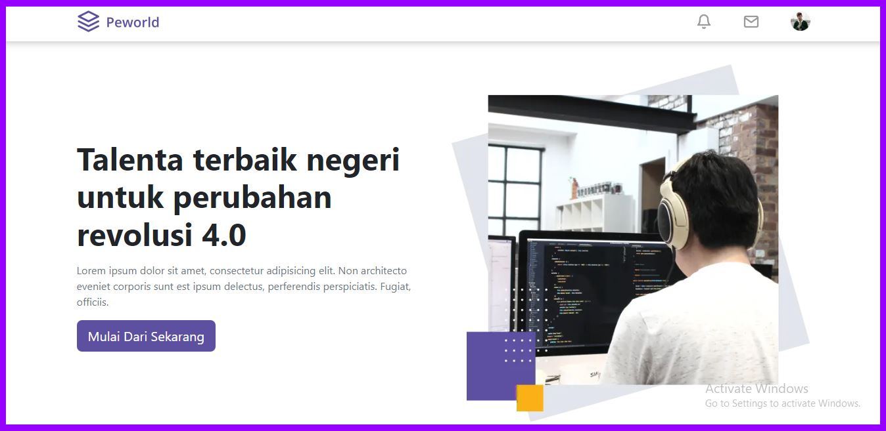
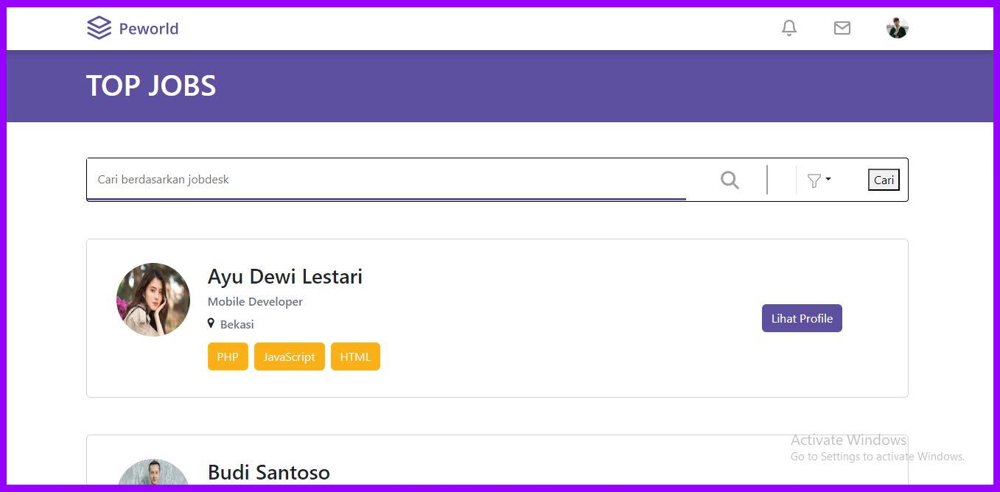
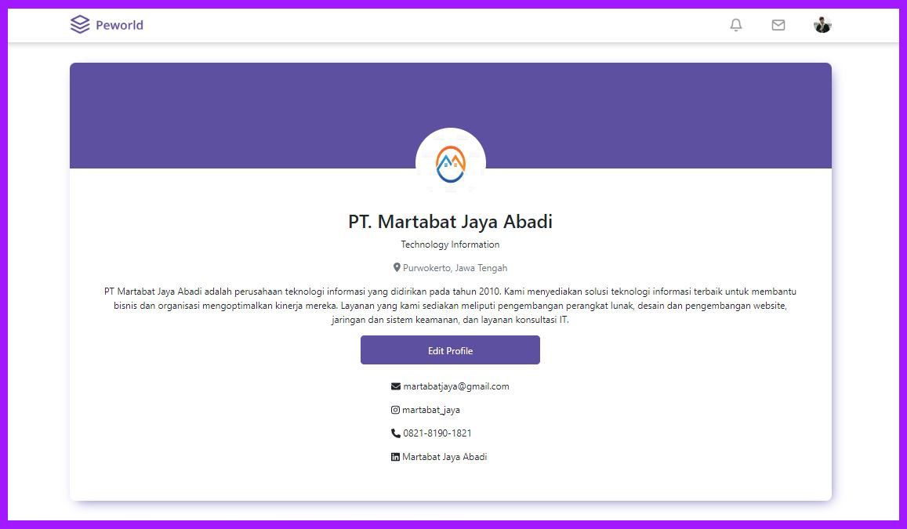
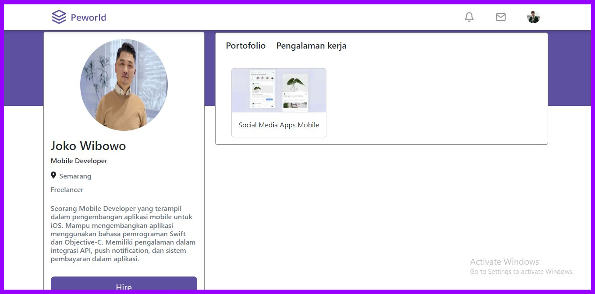
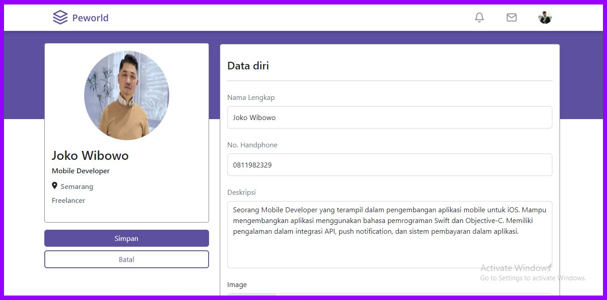
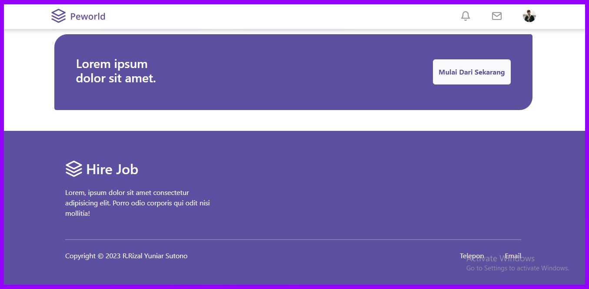
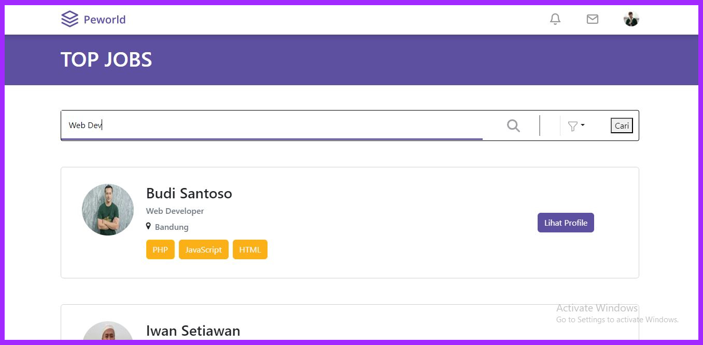
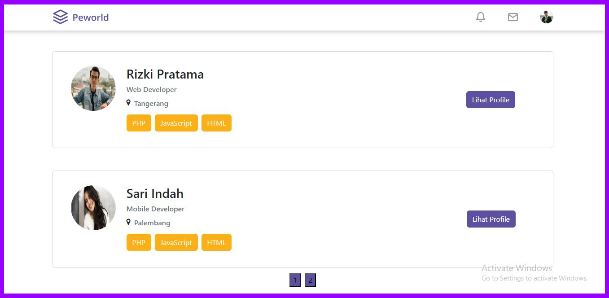

<br />
<p align="center">
<div align="center">
  
</div>
  <h3 align="center">Hire Job</h3>
  <p align="center">
    <a href="https://github.com/rizalyuniar/HireJob-FE/"><strong>Explore the docs »</strong></a>
    <br />
    <a href="https://hiree-job.vercel.app/">View Demo</a>
    ·
    <a href="/">Report Bug</a>
    ·
    <a href="/">Request Feature</a>
  </p>
</p>

<!-- TABLE OF CONTENTS -->

## Table of Contents

- [Table of Contents](#table-of-contents)
- [About The Project](#about-the-project)
  - [Built With](#built-with)
  - [Requirements](#requirements)
- [Getting Started](#getting-started)
  - [Prerequisites](#prerequisites)
  - [Installation](#installation)
  - [Setup .env](#setup-env)
- [Screenshots](#screenshots)
- [Contributing](#contributing)
- [Related Project](#related-project)
- [Contact](#contact)

<!-- ABOUT THE PROJECT -->

## About The Project

Hire Job application is a website built using NextJS on the Frontend side and ExpressJS on the Backend side. This application aims to build a website that can help in conducting job searches and recruiting people who need work. The features include, among others, There are 2 different users, namely as workers and as recruiters. Data management authentication such as registering and logging in users, editing and updating profiles, adding portfolios and work experience, and displaying lists of job seekers.

Translated with www.DeepL.com/Translator (free version)

### Built With

[](https://nextjs.org/)
[](https://expressjs.com/)
[](https://www.postgresql.org/)
[](https://getbootstrap.com/)

### Requirements

[](/)

<!-- GETTING STARTED -->

## Getting Started

### Prerequisites

This is an example of how to list things you need to use the software and how to install them.

- [nodejs](https://nodejs.org/en/download/)

### Installation

- Clone This Front End Repo

```
git clone https://github.com/rizalyuniar/HireJob-FE.git
```

- Go To Folder Repo

```
cd HireJob-FE
```

- Install Module

```
npm install
```

- <a href="#setup-env">Setup .env</a>
- Type ` npm run dev` To Start Website
- Type ` npm run production` To Start Production

### Setup .env

Create .env file in your root project folder.

```
API_BACKEND = [BACKEND_URL]
```

<!-- ROADMAP -->

## Screenshots

<table>
 <tr>
    <td></td>
    <td></td>
  </tr>
   <tr>
    <td>Login Page</td>
    <td>Register Page</td>
  </tr>
    <tr>
    <td> </td>
     <td></td>
  </tr>
   <tr>
    <td>Landing Page</td>
     <td>Home Page</td>
  </tr>
      <tr>
    <td> </td>
     <td></td>
  </tr>
   <tr>
    <td>Profile Company Page</td>
    <td>Profile Worker Page</td>
  </tr>
  <tr>
    <td> </td>
     <td></td>
  </tr>
   <tr>
    <td>Edit Profile Page</td>
     <td>Footer</td>
  </tr>
  <tr>
    <td> </td>
     <td></td>
  </tr>
   <tr>
    <td>Search Worker</td>
     <td>Pagination</td>
  </tr>
  
  
 
</table>

<!-- CONTRIBUTING -->

## Contributing

Contributions are what make the open source community such an amazing place to be learn, inspire, and create. Any contributions you make are **greatly appreciated**.

1. Fork the Project
2. Create your Feature Branch (`git checkout -b feature/AmazingFeature`)
3. Commit your Changes (`git commit -m 'Add some AmazingFeature'`)
4. Push to the Branch (`git push origin feature/AmazingFeature`)
5. Open a Pull Request

## Related Project

:rocket: [`Backend Hire Job`](https://github.com/rizalyuniar/hireJob-BE/)

:rocket: [`Frontend Hire Job`](https://github.com/rizalyuniar/hireJob-FE/)

:rocket: [`Demo Hire Job`](https://hiree-job.vercel.app/)

<!-- CONTACT -->

## Contact

My Email : rizalyuniar123@gmail.com

Project Link: [https://github.com/rizalyuniar/HireJob-FE/](https://github.com/rizalyuniar/HireJob-FE/)
